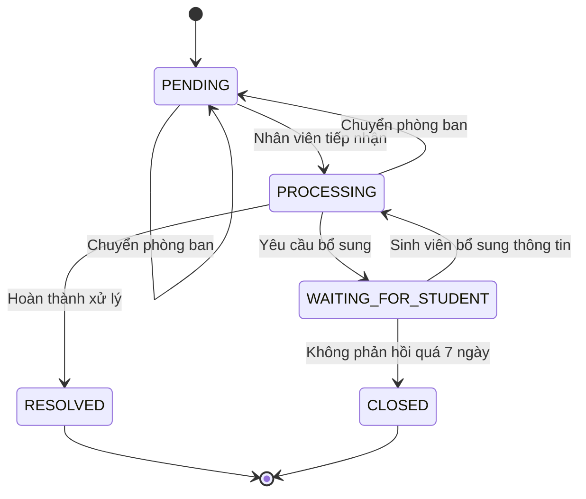
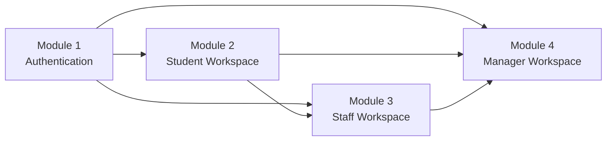

# TEAM CHARTER

## UniSupport - Student Support Management System

---

# I. Tổng quan và Bối cảnh

## 1. Bối cảnh & Tuyên bố vấn đề

### Bối cảnh

Aurora University hiện phục vụ khoảng **3.000 sinh viên**.

Quy trình tiếp nhận các yêu cầu hỗ trợ như:

- Hành chính
- Học tập
- Cơ sở vật chất
- Các vấn đề hỗ trợ sinh viên khác

hiện đang bị phân tán qua nhiều kênh:

- Email
- Microsoft Forms
- Tin nhắn cá nhân

### Vấn đề cốt lõi

- Thông tin có nguy cơ bị **thất lạc**.
- Thời gian phản hồi chậm, trung bình khoảng **3–5 ngày**.
- Sinh viên không thể biết **ai đang xử lý yêu cầu của mình**.
- Nhân viên có thể **xử lý trùng lặp hoặc bỏ sót công việc** do không có hệ thống điều phối tập trung.
- Ban Quản lý không có dữ liệu tổng hợp để **đánh giá hiệu suất phục vụ của các phòng ban**.

---

## 2. Giải pháp tổng thể

Xây dựng **Web Application UniSupport** nhằm tập trung hóa luồng giao tiếp và xử lý yêu cầu giữa **Sinh viên** và **Nhà trường**.

### Luồng xử lý tổng quát

```text
Sinh viên gửi Ticket
        ↓
Hệ thống đưa Ticket vào Queue của Phòng ban
        ↓
Nhân viên tiếp nhận và xử lý
        ↓
Phản hồi / yêu cầu bổ sung nếu cần
        ↓
Hoàn thành Ticket
        ↓
Sinh viên đánh giá chất lượng dịch vụ
```

---

## 3. Nguyên tắc phát triển mở rộng

### Không làm vỡ tính năng cũ

Các module sau chỉ:

- `consume` dữ liệu từ module trước
- hoặc `extend` chức năng dựa trên dữ liệu đã tồn tại

Không thay đổi logic cốt lõi theo cách gây ảnh hưởng đến các module đã hoàn thành.

### Single Source of Truth

Bảng `Tickets` là nguồn dữ liệu trung tâm của hệ thống.

Trạng thái Ticket chỉ được thay đổi theo **Ticket State Machine** đã định nghĩa.

Không được ghi đè hoặc xóa dữ liệu lịch sử xử lý Ticket.

---

# II. Tiêu chuẩn kỹ thuật và Quy tắc dữ liệu

## 1. Data Conventions

### Ticket ID

Định dạng:

```text
TK-YYYYMMDD-XXXX
```

Ví dụ:

```text
TK-20261001-0042
```

Trong đó:

- `YYYYMMDD`: ngày tạo Ticket
- `XXXX`: số thứ tự tự động tăng trong ngày

---

### File đính kèm

Các định dạng được phép:

```text
.png
.jpg
.jpeg
.pdf
```

Giới hạn:

- Tối đa **5 MB / file**
- Tối đa **3 file / lần gửi**

---

### Data Isolation

#### Sinh viên

Sinh viên chỉ được phép `READ` các Ticket do chính tài khoản đó tạo.

```text
created_by = current_user.id
```

#### Nhân viên

Nhân viên chỉ được phép `READ / WRITE` các Ticket thuộc phòng ban của mình.

```text
department_id = current_user.department_id
```

---

## 2. Ticket State Machine

Mọi chức năng xử lý Ticket phải tuân thủ các trạng thái và chuyển đổi sau:



### Mapping trạng thái

| Status | Hiển thị |
|---|---|
| `PENDING` | Chờ tiếp nhận |
| `PROCESSING` | Đang xử lý |
| `WAITING_FOR_STUDENT` | Chờ bổ sung |
| `RESOLVED` | Hoàn thành |
| `CLOSED` | Đã đóng |

### Auto-close Rule

Nếu Ticket ở trạng thái:

```text
WAITING_FOR_STUDENT
```

quá **7 ngày / 168 giờ** mà không có tương tác mới từ Sinh viên, hệ thống tự động chuyển sang:

```text
CLOSED
```

Việc đóng Ticket được thực hiện bởi **System Job**.

---

# III. Đặc tả chức năng

# Module 1: Authentication Base

Module xác thực là nền tảng cho toàn bộ hệ thống.

---

## 1.1. Đăng nhập hệ thống

### User Story

> Là người dùng gồm Sinh viên, Nhân viên hoặc Quản lý, tôi muốn đăng nhập bằng Email và Mật khẩu do trường cấp để truy cập đúng không gian làm việc của mình.

### Input Validation

| Field | Required | Validation |
|---|---:|---|
| `email` | Yes | Đúng định dạng email `@aurora.edu.vn` |
| `password` | Yes | Độ dài từ `6–32` ký tự |

### Acceptance Criteria

#### AC 1.1

Đăng nhập thành công:

- Trả về `JWT Token`
- Lưu thông tin `Role`
- Điều hướng theo Role

| Role | Destination |
|---|---|
| Student | Trang gửi Ticket |
| Staff | Queue phòng ban |
| Manager | Dashboard |

#### AC 1.2

Nếu:

- Email không tồn tại
- hoặc mật khẩu không chính xác

hiển thị:

```text
Thông tin đăng nhập không chính xác
```

#### AC 1.3

Nếu nhập sai mật khẩu **5 lần liên tiếp**:

- Khóa tài khoản tạm thời
- Thời gian khóa: **15 phút**

---

## 1.2. Đổi mật khẩu

### User Story

> Là người dùng đã đăng nhập, tôi muốn chủ động thay đổi mật khẩu cá nhân để đảm bảo an toàn tài khoản.

### Acceptance Criteria

#### AC 2.1

Người dùng phải nhập:

- Mật khẩu cũ
- Mật khẩu mới
- Xác nhận mật khẩu mới

#### AC 2.2

Mật khẩu mới không được trùng với mật khẩu cũ.

---

# Module 2: Student Workspace

Module dành cho Sinh viên, mở rộng dựa trên Authentication Base.

---

## 2.1. Tạo Ticket hỗ trợ mới

### User Story

> Là Sinh viên, tôi muốn chọn Phòng ban / Danh mục và nhập nội dung cần hỗ trợ để gửi yêu cầu lên hệ thống.

### Input Fields

| Field | Type | Required | Validation |
|---|---|---:|---|
| `department_id` | Dropdown | Yes | Chọn từ danh sách Phòng ban khả dụng |
| `category_id` | Dropdown | Yes | Phải thuộc `department_id` đã chọn |
| `title` | Text Input | Yes | Từ `10–150` ký tự |
| `description` | Textarea | Yes | Từ `20–2000` ký tự |
| `attachments` | File Upload | No | Tối đa `3 file`, `5 MB/file` |

### Acceptance Criteria

#### AC 1.1

Khi Sinh viên bấm:

```text
Gửi yêu cầu
```

hệ thống tạo Ticket mới với:

```text
status = PENDING
```

#### AC 1.2

Sau khi tạo Ticket thành công:

- Hiển thị `Ticket ID`
- Gửi Email xác nhận đến Email của Sinh viên

---

## 2.2. Theo dõi Ticket

### Acceptance Criteria

#### AC 2.1

Trang danh sách Ticket hiển thị:

- Mã Ticket
- Tiêu đề
- Ngày tạo
- Phòng ban phụ trách
- Trạng thái

Trạng thái được hiển thị bằng **Badge màu tương ứng**.

#### AC 2.2

Trang chi tiết Ticket hiển thị **Timeline** toàn bộ quá trình xử lý từ lúc Ticket được tạo đến trạng thái hiện tại.

---

## 2.3. Bổ sung thông tin Ticket

Chức năng này sử dụng cơ chế:

```text
Append-only
```

Sinh viên **không sửa dữ liệu cũ** mà tạo thêm phản hồi mới.

### Điều kiện

Ticket phải có trạng thái:

```text
WAITING_FOR_STUDENT
```

### Acceptance Criteria

#### AC 3.1

Sinh viên có thể nhập:

- Nội dung bổ sung
- File đính kèm mới

Sau đó chọn:

```text
Gửi bổ sung
```

#### AC 3.2

Sau khi gửi thành công:

```text
status = PROCESSING
```

Hệ thống đồng thời gửi thông báo đến Nhân viên đang phụ trách Ticket.

---

## 2.4. Đánh giá chất lượng dịch vụ

### Điều kiện

Ticket phải có:

```text
status = RESOLVED
```

### Acceptance Criteria

#### AC 4.1

Form đánh giá gồm:

| Field | Required |
|---|---:|
| Rating `1–5 sao` | Yes |
| Nhận xét | No |

#### AC 4.2

Sau khi gửi đánh giá thành công:

- Không thể gửi lại đánh giá
- Form chuyển sang chế độ `Read-only`

---

# Module 3: Staff Workspace

Module dành cho Nhân viên xử lý các Ticket do Sinh viên tạo.

---

## 3.1. Queue Management

### Acceptance Criteria

#### AC 1.1

Nhân viên chỉ xem được Ticket có:

```text
ticket.department_id = current_user.department_id
```

#### AC 1.2

Queue hỗ trợ:

- Lọc theo trạng thái
  - Chờ tiếp nhận
  - Đang xử lý
  - Chờ bổ sung
- Lọc theo khoảng thời gian
- Tìm kiếm theo:
  - Mã Ticket
  - Tiêu đề

---

## 3.2. Tiếp nhận Ticket

### Condition

```text
status = PENDING
```

### Acceptance Criteria

#### AC 2.1

Khi Nhân viên bấm:

```text
Tiếp nhận
```

hệ thống cập nhật:

```text
assignee_id = current_user.id
status = PROCESSING
```

#### AC 2.2 – Race Condition Handling

Nếu hai Nhân viên cùng tiếp nhận một Ticket tại cùng thời điểm:

- Database sử dụng Lock / Transaction để đảm bảo chỉ một người tiếp nhận thành công.
- Người tiếp nhận sau nhận thông báo:

```text
Ticket đã được tiếp nhận bởi [Tên Nhân Viên]
```

- Giao diện tự động Refresh dữ liệu.

---

## 3.3. Yêu cầu Sinh viên bổ sung thông tin

### Condition

```text
status = PROCESSING
AND
assignee_id = current_user.id
```

### Acceptance Criteria

#### AC 3.1

Nhân viên nhập lý do yêu cầu bổ sung.

Sau khi xác nhận:

```text
status = WAITING_FOR_STUDENT
```

---

## 3.4. Chuyển Ticket sang Phòng ban khác

### Acceptance Criteria

#### AC 4.1

Nhân viên phải:

1. Chọn Phòng ban mới
2. Nhập lý do chuyển

Sau đó hệ thống cập nhật:

```text
department_id = new_department_id
assignee_id = NULL
status = PENDING
```

Ticket sau đó xuất hiện trong Queue của Phòng ban mới.

---

## 3.5. Hoàn thành Ticket

### Acceptance Criteria

#### AC 5.1

Nhân viên nhập:

- Nội dung giải quyết — **Bắt buộc**
- File kết quả — Không bắt buộc

Sau khi hoàn thành:

```text
status = RESOLVED
```

---

# Module 4: Manager Workspace

Module Quản lý tổng hợp dữ liệu từ toàn bộ hệ thống để phục vụ báo cáo và quản trị.

---

## 4.1. Analytics Dashboard

### Nguồn dữ liệu

Dashboard lấy dữ liệu từ:

```text
Tickets
Ratings
```

### Acceptance Criteria

#### AC 1.1 – KPI Cards

Dashboard hiển thị **4 KPI chính**:

| KPI | Mô tả |
|---|---|
| Tổng Ticket | Tổng số Ticket được tiếp nhận trong khoảng thời gian |
| Tỷ lệ xử lý đúng hạn | % Ticket được xử lý trong thời gian SLA |
| Ticket quá hạn | Số Ticket đang vượt thời gian xử lý |
| CSAT Score | Điểm hài lòng trung bình từ `1.0–5.0` |

### SLA Rule

Ticket được xem là **quá hạn** nếu:

```text
Thời gian xử lý > 48 giờ làm việc
AND
status != RESOLVED
```

#### AC 1.2 – Biểu đồ

Dashboard hiển thị biểu đồ cột:

```text
Số lượng Ticket theo từng Nhóm vấn đề
```

---

## 4.2. Quản lý tài khoản & phân quyền

### Acceptance Criteria

#### AC 2.1

Manager có thể tạo mới / chỉnh sửa:

- Tên
- Email
- Chức vụ
- Vai trò
- Phòng ban

Các Role:

```text
STUDENT
STAFF
MANAGER
```

#### AC 2.2

Manager có thể vô hiệu hóa tài khoản bằng:

```text
Soft Delete / Deactivate
```

Sau khi bị vô hiệu hóa:

- Tài khoản không thể đăng nhập
- Dữ liệu Ticket lịch sử vẫn được giữ nguyên

---

## 4.3. Quản lý danh mục hỗ trợ

### Acceptance Criteria

#### AC 3.1

Manager có thể:

- Thêm Nhóm vấn đề
- Sửa tên Nhóm vấn đề
- Ẩn / Deactivate Nhóm vấn đề

Mỗi Category thuộc một Phòng ban cụ thể.

#### AC 3.2

Khi Category bị `Deactivate`:

- Không xuất hiện trong Dropdown tạo Ticket mới của Sinh viên.
- Các Ticket cũ thuộc Category đó vẫn được giữ nguyên.
- Vẫn hiển thị trong:
  - Tra cứu Ticket
  - Lịch sử
  - Báo cáo
  - Dashboard

---

# IV. Tổng quan Module Dependency



| Module | Phụ thuộc | Vai trò |
|---|---|---|
| Module 1 | Không | Authentication & Authorization |
| Module 2 | Module 1 | Sinh viên tạo và theo dõi Ticket |
| Module 3 | Module 1, 2 | Nhân viên xử lý Ticket |
| Module 4 | Module 1, 2, 3 | Quản trị và báo cáo |

---

# V. Core Business Rules

1. Mọi Ticket phải có một `department_id`.
2. Ticket mới luôn bắt đầu với trạng thái `PENDING`.
3. Chỉ Ticket `PENDING` mới có thể được Claim.
4. Chỉ Nhân viên đang được assign mới có quyền xử lý Ticket.
5. Sinh viên không được chỉnh sửa lịch sử Ticket.
6. Mọi phản hồi mới phải được lưu theo cơ chế **Append-only**.
7. Ticket chỉ được chuyển trạng thái theo **State Machine**.
8. Ticket `WAITING_FOR_STUDENT` quá 7 ngày sẽ tự động `CLOSED`.
9. Ticket lịch sử không bị xóa khi User / Category bị Deactivate.
10. Manager có quyền xem dữ liệu tổng hợp nhưng không làm thay đổi lịch sử xử lý Ticket.
